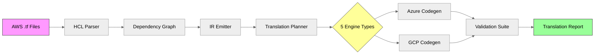
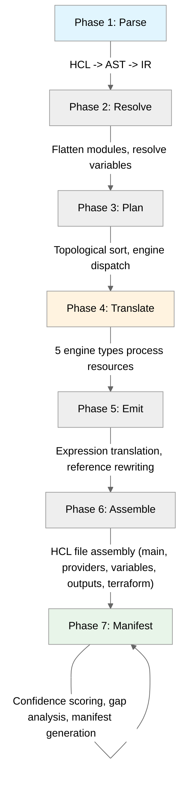

# AWS Terraform Translation Platform (TLA)

> Translate AWS Terraform to Azure and GCP with full service equivalence registry, validation, and portable authoring.


---

## What It Does

The TLA platform ingests AWS Terraform HCL configurations and translates them into native Azure (`azurerm`) and GCP (`google`) Terraform code. It does not produce abstraction layers or wrappers -- every output file is idiomatic, provider-native HCL that you can `terraform plan` and `terraform apply` directly.

The translation engine covers **22 AWS services** across **5 engine types**: direct (1:1 attribute mapping), parametric (cross-resource reference resolution), compound (1:N resource expansion), structural (topology reshaping with intent analysis), and advisory (human-guided migration stubs). Each translated resource carries a confidence score, traceability metadata linking it back to the source, and a manifest of behavioral gaps that require attention.

Beyond translation, the platform includes a full **validation suite** (semantic diff, policy evaluation, compliance checking, confidence scoring, and cost estimation), an **MCP server** exposing 10 tools for AI agent integration (Claude Code, Cursor, etc.), a **VS Code extension** for inline translation hints and diagnostics, and a **Go Terraform provider** that lets you author portable `cloud_*` resources targeting any supported cloud.

---

## Architecture



---

## Quick Start

```bash
# Clone and install
git clone <repo-url>
cd Translation_Platform
pnpm install
pnpm build

# Translate AWS to Azure
npx tla translate ./my-aws-terraform --target azure --output ./azure-output

# Translate AWS to GCP
npx tla translate ./my-aws-terraform --target gcp --output ./gcp-output

# Assessment only (no translation output, just the report)
npx tla translate ./my-aws-terraform --target azure --scope assessment

# Validate an existing translation
npx tla validate ./azure-output --source ./my-aws-terraform

# Registry report
npx tla registry-report --format table
```

---

## Package Overview

| Package | Path | Description | Key Exports |
|---------|------|-------------|-------------|
| **@tla/shared** | `packages/shared` | Shared types, Zod schemas, audit trail | `CanonicalIR`, `TranslationManifest`, `AuditLogger` |
| **@tla/ingestion** | `packages/ingestion` | HCL parsing, dependency graph, IR generation | `parseHclDirectory`, `IrEmitter`, `DependencyGraph` |
| **@tla/registry** | `packages/registry` | Service equivalence registry (22 AWS services) | `RegistryApi`, `loadRegistryFromDirectory` |
| **@tla/translator** | `packages/translator` | Translation engines + Azure/GCP codegen | `TranslationCompiler`, `AzureCodeGenerator`, `GcpCodeGenerator` |
| **@tla/validator** | `packages/validator` | Validation, policy, compliance, cost estimation | `checkEquivalence`, `evaluatePolicies`, `checkCompliance`, `scoreConfidence` |
| **@tla/mcp-server** | `packages/mcp-server` | MCP server (10 tools) for AI agent integration | `translate`, `equivalence-lookup`, `validate`, `migrate-state` |
| **@tla/cli** | `packages/cli` | Command-line interface | `tla translate`, `tla validate-registry`, `tla registry-report` |
| **ide-extension** | `packages/ide-extension` | VS Code extension for inline hints | Completions, diagnostics, lint rules |
| **terraform-provider** | `packages/terraform-provider` | Go Terraform provider for portable resources | `cloud_object_storage`, `cloud_container_registry`, `cloud_cache_redis` |
| **integration-tests** | `packages/integration-tests` | End-to-end test suite | Azure E2E, GCP E2E, edge case fixtures |

---

## Translation Pipeline

The compiler executes a 7-phase pipeline for each translation:



### Engine Types

| Engine | Band | Description | Example Services |
|--------|------|-------------|-----------------|
| **Direct** | P1 | 1:1 attribute mapping | S3, ECR, ElastiCache Redis, Route53, VPC Peering |
| **Parametric** | P2 | Cross-resource reference resolution | VPC, Subnet, NAT Gateway, KMS, Secrets Manager, EKS |
| **Compound** | P2 | 1:N resource expansion | EC2 (VM+NIC+Disk), ASG, ALB/NLB, RDS |
| **Structural** | P2 | Topology reshaping with intent analysis | Security Groups, Lambda, ECS, SQS, SNS, CloudWatch |
| **Advisory** | M1 | Human-guided migration stubs | DynamoDB, IAM, CloudFront, Route53 Health, ElastiCache Cluster |

---

## MCP Server Tools

The MCP server exposes 10 tools for AI agent integration:

| Tool | Description |
|------|-------------|
| `translate` | Translate an AWS Terraform directory to Azure or GCP |
| `equivalence-lookup` | Look up the Azure/GCP equivalent for an AWS resource type |
| `validate` | Run the full validation suite on a translation |
| `migrate-state` | Generate state migration commands for an existing deployment |
| `list-services` | List all mapped AWS services and their translation bands |
| `assess` | Run assessment-only mode (no file output) |
| `explain-gap` | Explain a specific behavioral gap finding |
| `cost-estimate` | Estimate cost differences between source and target |
| `compliance-check` | Run CIS compliance checks against translated output |
| `registry-report` | Generate a registry coverage report |

### MCP Configuration

```json
{
  "mcpServers": {
    "tla": {
      "command": "npx",
      "args": ["@tla/mcp-server", "start"],
      "env": {
        "TLA_REGISTRY_DIR": "./packages/registry/data"
      }
    }
  }
}
```

---

## Supported Resources

### Complete AWS to Azure/GCP Mapping Table

Every AWS resource below has a dedicated translation engine. The **Band** indicates translation confidence: P1 (highest, direct mapping) through M1 (advisory only, manual migration required).

#### Compute

| AWS Resource | Azure Target | GCP Target | Band | Engine |
|---|---|---|---|---|
| `aws_instance` (EC2) | `azurerm_linux_virtual_machine` | `google_compute_instance` | P1 | Compound (VM + NIC + Disk) |
| `aws_autoscaling_group` | `azurerm_linux_virtual_machine_scale_set` | `google_compute_instance_group_manager` + `google_compute_autoscaler` | N1 | Compound |
| `aws_lambda_function` | `azurerm_linux_function_app` | `google_cloudfunctions2_function` | N1 | Structural (trigger detection) |
| `aws_ecs_service` / `aws_ecs_task_definition` | `azurerm_container_app` + `azurerm_container_app_environment` | `google_cloud_run_v2_service` | N1 | Structural |
| `aws_eks_cluster` | `azurerm_kubernetes_cluster` | `google_container_cluster` | P2 | Parametric |
| `aws_ecs_service` (Fargate) | `azurerm_container_group` | `google_cloud_run_v2_service` | N1 | Parametric |
| `aws_sfn_state_machine` (Step Functions) | `azurerm_logic_app_workflow` | `google_workflows_workflow` | M1 | Structural (ASL definition is advisory) |

#### Storage

| AWS Resource | Azure Target | GCP Target | Band | Engine |
|---|---|---|---|---|
| `aws_s3_bucket` | `azurerm_storage_account` + `azurerm_storage_container` | `google_storage_bucket` | P1 | Direct |
| `aws_ecr_repository` | `azurerm_container_registry` | `google_artifact_registry_repository` | P1 | Direct |
| `aws_ebs_volume` | `azurerm_managed_disk` | `google_compute_disk` | N1 | Compound |
| `aws_efs_file_system` | `azurerm_storage_account` + `azurerm_storage_share` | `google_filestore_instance` | N1 | Structural |

#### Database

| AWS Resource | Azure Target | GCP Target | Band | Engine |
|---|---|---|---|---|
| `aws_db_instance` (RDS) | `azurerm_postgresql_flexible_server` / `azurerm_mysql_flexible_server` / `azurerm_mssql_server` | `google_sql_database_instance` | P2 | Compound (engine-specific routing) |
| `aws_elasticache_replication_group` | `azurerm_redis_cache` | `google_redis_instance` | P1 | Direct |
| `aws_dynamodb_table` | *(advisory only)* | *(advisory only)* | M1 | Advisory (data model divergence) |

#### Networking

| AWS Resource | Azure Target | GCP Target | Band | Engine |
|---|---|---|---|---|
| `aws_vpc` | `azurerm_virtual_network` | `google_compute_network` | P2 | Parametric |
| `aws_subnet` | `azurerm_subnet` | `google_compute_subnetwork` | P2 | Parametric |
| `aws_security_group` | `azurerm_network_security_group` + `azurerm_network_security_rule` | `google_compute_firewall` | N1 | Structural (BLOCKER gate on rule broadening) |
| `aws_lb` (ALB) | `azurerm_application_gateway` | `google_compute_url_map` + `google_compute_backend_service` | N1 | Compound |
| `aws_lb` (NLB) | `azurerm_lb` | `google_compute_forwarding_rule` | N1 | Compound |
| `aws_nat_gateway` | `azurerm_nat_gateway` | `google_compute_router_nat` + `google_compute_router` | N1 | Parametric |
| `aws_route53_zone` / `aws_route53_record` | `azurerm_dns_zone` + `azurerm_dns_a_record` | `google_dns_managed_zone` + `google_dns_record_set` | P2 | Direct |
| `aws_vpc_peering_connection` | `azurerm_virtual_network_peering` | `google_compute_network_peering` | P2 | Direct |
| `aws_ec2_transit_gateway` | Azure Virtual WAN / vHub | GCP Network Connectivity Center | N1 | Structural (topology pattern) |
| `aws_vpc_endpoint` (PrivateLink) | Azure Private Endpoint / Private Link Service | GCP Private Service Connect | N1 | Structural (producer/consumer) |
| `aws_cloudfront_distribution` | `azurerm_cdn_frontdoor_profile` + endpoint + route | `google_compute_url_map` + `google_compute_backend_bucket` | N1 | Compound |

#### Hybrid Connectivity

| AWS Resource | Azure Target | GCP Target | Band | Engine |
|---|---|---|---|---|
| `aws_dx_connection` (Direct Connect) | `azurerm_express_route_circuit` | `google_compute_interconnect_attachment` | N1 | Parametric |
| `aws_dx_gateway` | `azurerm_express_route_gateway` | `google_compute_router` (BGP) | N1 | Parametric |
| `aws_vpn_gateway` | `azurerm_virtual_network_gateway` (VPN) | `google_compute_vpn_gateway` | N1 | Parametric |
| `aws_vpn_connection` | `azurerm_virtual_network_gateway_connection` | `google_compute_vpn_tunnel` | N1 | Parametric |
| `aws_customer_gateway` | `azurerm_local_network_gateway` | `google_compute_external_vpn_gateway` | N1 | Parametric |

#### Security & Identity

| AWS Resource | Azure Target | GCP Target | Band | Engine |
|---|---|---|---|---|
| `aws_kms_key` | `azurerm_key_vault_key` | `google_kms_crypto_key` | P2 | Parametric |
| `aws_secretsmanager_secret` | `azurerm_key_vault_secret` | `google_secret_manager_secret` | P2 | Parametric |
| `aws_iam_role` / `aws_iam_policy` | *(advisory only)* | *(advisory only)* | M1 | Advisory (identity architecture divergent) |
| `aws_wafv2_web_acl` | `azurerm_web_application_firewall_policy` | `google_compute_security_policy` | N1 | Structural |

#### Application Integration

| AWS Resource | Azure Target | GCP Target | Band | Engine |
|---|---|---|---|---|
| `aws_api_gateway_rest_api` | `azurerm_api_management` + `azurerm_api_management_api` | `google_api_gateway_api` + `google_api_gateway_api_config` + `google_api_gateway_gateway` | N1 | Compound |
| `aws_sqs_queue` | Azure Service Bus Queue | GCP Pub/Sub | N1 | Structural |
| `aws_sns_topic` | Azure Event Grid / Service Bus Topic | GCP Pub/Sub | N1 | Structural |
| `aws_cloudwatch_metric_alarm` | Azure Monitor metric alert | GCP Cloud Monitoring alert | N1 | Structural |

#### Additional Terraform Resources Handled

These resource types are recognized and classified but do not require dedicated translation:

| Resource Type | Classification | Handling |
|---|---|---|
| `null_resource` | Procedural | Advisory — flagged for review |
| `random_*` (random_id, random_string, etc.) | Utility | Preserved as-is (cloud-neutral) |
| `template_*` | Utility | Preserved as-is |
| `helm_release` / `kubernetes_*` | Orchestration | Skipped (managed separately) |
| `data "external"` | Procedural | Advisory — flagged as non-portable |
| `provisioner "local-exec"` | Side-effect | Advisory — manual task emitted |

### Translation Band Summary

| Band | Meaning | Count | Confidence |
|------|---------|-------|------------|
| **P1** | Direct 1:1 mapping, high confidence | 4 | 0.85-0.95 |
| **P2** | Parametric with attribute transformation | 8 | 0.70-0.85 |
| **N1** | Requires manual attention, compound/structural | 17 | 0.50-0.70 |
| **M1** | Advisory only, manual migration required | 3 | 0.10-0.30 |

> **Total: 32+ AWS resource types** with dedicated translation logic across 5 engine types.

---

## Validation Suite

The platform includes 7 validation checks that run against every translation:

| Check | Description |
|-------|-------------|
| **Syntax Validation** | Verifies generated HCL is syntactically valid |
| **HCL Validation** | Runs `terraform validate` against generated output |
| **Policy Evaluation** | Evaluates custom policy rules (e.g., no public endpoints) |
| **Compliance Checking** | CIS benchmark compliance (Basic: 5 rules, Advanced: 8 rules) |
| **Semantic Diff** | Compares source and target resource graphs for equivalence |
| **Confidence Scoring** | Aggregate confidence score with per-resource breakdown |
| **Cost Estimation** | Estimates monthly cost delta between source and target |

### Compliance Profiles

- **CIS-Basic** (5 rules): Encryption at rest, encryption in transit, no public access, logging enabled, tagging required
- **CIS-Advanced** (8 rules): All Basic rules plus network segmentation, key rotation, access logging

---

## Test Suite

- **3,130+ tests** across 8 packages
- **TypeScript** tests via Vitest, **Go** tests via `go test`
- **End-to-end tests** for both Azure and GCP translation targets
- **12 edge case fixtures** derived from PRD Section 13
- **Performance benchmarks** against a 500-resource fixture
- **Determinism verification** via hash comparison across runs

```bash
# Run all tests
pnpm test

# Run specific package tests
pnpm --filter @tla/translator test
pnpm --filter @tla/validator test

# Run Go provider tests
cd packages/terraform-provider && go test ./...

# Run E2E tests
pnpm --filter @tla/integration-tests test

# Run with coverage
pnpm test -- --coverage
```

---

## Configuration Reference

### Environment Variables

| Variable | Default | Description |
|----------|---------|-------------|
| `TLA_REGISTRY_DIR` | `./packages/registry/data` | Path to service equivalence registry YAML files |
| `TLA_TERRAFORM_BIN` | `terraform` | Path to Terraform or OpenTofu binary (used by validator) |
| `TLA_LOG_LEVEL` | `info` | Logging level: `debug`, `info`, `warn`, `error` |
| `TLA_COMPLIANCE_PROFILE` | `cis-basic` | Default compliance profile: `cis-basic`, `cis-advanced` |
| `TLA_MAX_CONCURRENCY` | `4` | Maximum parallel resource translations |
| `TLA_OUTPUT_FORMAT` | `hcl` | Output format: `hcl`, `json` |

### MCP Server Configuration

```json
{
  "mcpServers": {
    "tla": {
      "command": "npx",
      "args": ["@tla/mcp-server", "start"],
      "env": {
        "TLA_REGISTRY_DIR": "./packages/registry/data",
        "TLA_LOG_LEVEL": "info",
        "TLA_COMPLIANCE_PROFILE": "cis-basic"
      }
    }
  }
}
```

### Compliance Profile Selection

```bash
# Use CIS-Basic (default)
npx tla validate ./output --compliance cis-basic

# Use CIS-Advanced
npx tla validate ./output --compliance cis-advanced
```

---

## Documentation

| Document | Description |
|----------|-------------|
| [Getting Started Guide](docs/GETTING-STARTED.md) | Step-by-step setup, first translation walkthrough |
| [Architecture Deep Dive](docs/ARCHITECTURE.md) | Internal pipeline, engine design, IR schema |
| [MCP & IDE Integration](docs/MCP-INTEGRATION.md) | MCP server setup, VS Code extension, AI agent workflows |
| [GitHub Repository Scanning](docs/GITHUB-INTEGRATION.md) | Scan GitHub repos for AWS Terraform and translate in CI |
| [Portable Provider Guide](docs/PROVIDER-GUIDE.md) | Using `cloud_*` resources in the Go Terraform provider |

---

## Contributing

### Prerequisites

- **Node.js** 22+ with **pnpm**
- **Go** 1.22+ (for the Terraform provider)
- **Terraform** or **OpenTofu** (optional, for validation checks)

### Development Workflow

```bash
# Install dependencies
pnpm install

# Build all packages
pnpm build

# Run tests
pnpm test

# Type checking
pnpm typecheck

# Lint
pnpm lint

# Build the Go provider
cd packages/terraform-provider
go build ./...
go test ./...
```

### Project Structure

```
Translation_Platform/
  packages/
    shared/           # Shared types, Zod schemas, audit trail
    ingestion/        # HCL parser, dependency graph, IR emitter
    registry/         # Service equivalence registry (YAML)
    translator/       # 5 engine types + Azure/GCP codegen
    validator/        # Validation, policy, compliance
    mcp-server/       # MCP server (10 tools)
    cli/              # Command-line interface
    ide-extension/    # VS Code extension
    terraform-provider/ # Go Terraform provider
    integration-tests/  # E2E test suite
  docs/               # Documentation
```

### Architecture Reference

This project follows **PRD-CTP-002 v3.0**. All translation engines implement the `MappingEngine` plugin interface. The `TranslationCompiler` orchestrates the 7-phase pipeline. Codegen is provider-specific (`AzureCodeGenerator`, `GcpCodeGenerator`) and produces idiomatic HCL via the shared `hcl-writer`.

---

## License

This project is licensed under the [MIT License](LICENSE).
