# TLA Translation Platform -- Architecture Deep Dive

> **Version**: 0.1.0 | **Last Updated**: 2026-03-26 | **Node**: >=22.0.0 | **Go**: 1.21+

---

## 1. System Overview

The TLA (Terraform Landing Zone Accelerator) platform translates AWS Terraform configurations into Azure or GCP equivalents. It is organized as a pnpm monorepo with 10 packages spanning TypeScript libraries, an MCP server, a Go-based Terraform provider, integration tests, and a VS Code extension.

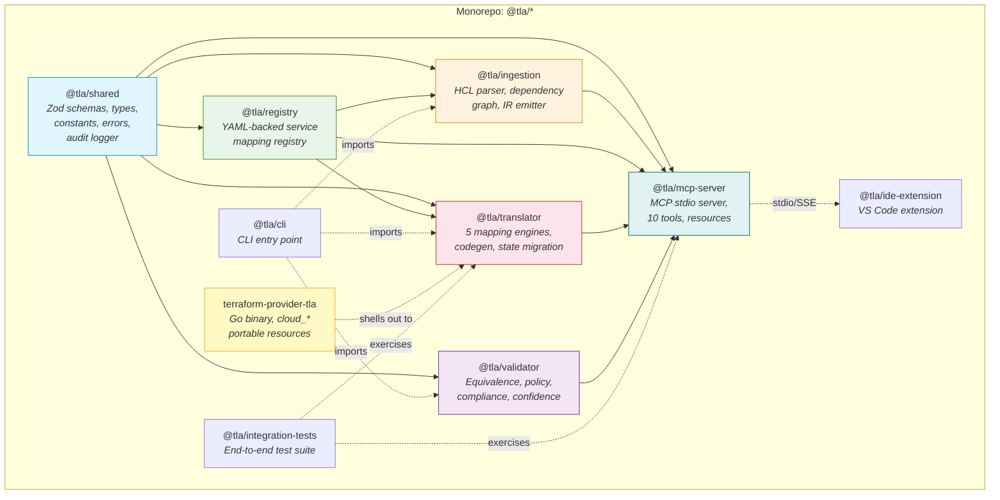

---

## 2. Translation Pipeline

The full pipeline transforms raw `.tf` files into validated, target-provider infrastructure code through 9 discrete stages.

```mermaid
flowchart LR
    A["<b>1. HCL Parse</b><br/>@cdktf/hcl2json<br/>→ HclAst"] --> B["<b>2. Dependency<br/>Graph</b><br/>DependencyGraph<br/>+ analyzeGraph"]
    B --> C["<b>3. IR Emit</b><br/>IrEmitter<br/>detectIntents<br/>→ CanonicalIR"]
    C --> D["<b>4. Registry<br/>Lookup</b><br/>RegistryApi.lookup<br/>per sourceType"]
    D --> E["<b>5. Translation<br/>Planner</b><br/>Kahn's toposort<br/>→ TranslationPlan"]
    E --> F["<b>6. Engine<br/>Selection</b><br/>getEngine by<br/>mappingType"]
    F --> G["<b>7. Engine<br/>Emit</b><br/>engine.translate<br/>→ TranslatedResource[]"]
    G --> H["<b>8. Codegen +<br/>File Assembly</b><br/>Azure/GcpCodeGenerator<br/>→ .tf files"]
    H --> I["<b>9. Validation</b><br/>syntax → policy →<br/>compliance →<br/>semantic → confidence<br/>→ cost"]

    style A fill:#fff3e0,stroke:#f57c00
    style B fill:#fff3e0,stroke:#f57c00
    style C fill:#fff3e0,stroke:#f57c00
    style D fill:#e8f5e9,stroke:#388e3c
    style E fill:#fce4ec,stroke:#c62828
    style F fill:#fce4ec,stroke:#c62828
    style G fill:#fce4ec,stroke:#c62828
    style H fill:#fce4ec,stroke:#c62828
    style I fill:#f3e5f5,stroke:#7b1fa2
```

### Pipeline Detail

| Stage | Package | Key Function / Class | Input | Output |
|-------|---------|---------------------|-------|--------|
| 1. HCL Parse | `@tla/ingestion` | `parseHclFile`, `parseHclDirectory` | `.tf` files | `HclAst` |
| 2. Dependency Graph | `@tla/ingestion` | `DependencyGraph`, `analyzeGraph` | `HclAst` | `SerializedGraph`, `GraphAnalysis` |
| 3. IR Emit | `@tla/ingestion` | `IrEmitter.emit()`, `detectIntents` | `HclAst` + `GraphAnalysis` | `CanonicalIR` |
| 4. Registry Lookup | `@tla/registry` | `RegistryApi.lookup(sourceType)` | Resource type string | `RegistryEntry` |
| 5. Translation Plan | `@tla/translator` | `buildTranslationPlan()` | `CanonicalIR` + registry | `TranslationPlan` (toposorted) |
| 6. Engine Selection | `@tla/translator` | `getEngine(mappingType)` | `MappingType` enum | `MappingEngine` instance |
| 7. Engine Emit | `@tla/translator` | `engine.translate(ctx)` | `TranslationContext` | `EngineResult` (resources + findings) |
| 8. Codegen | `@tla/translator` | `AzureCodeGenerator` / `GcpCodeGenerator` | `TranslatedResource[]` | `.tf` file map |
| 9. Validation | `@tla/validator` | `checkEquivalence`, `evaluatePolicies`, etc. | Translated dir + IR | Validation reports |

---

## 3. Package Dependency Graph

All inter-package dependencies flow in one direction -- no cycles.

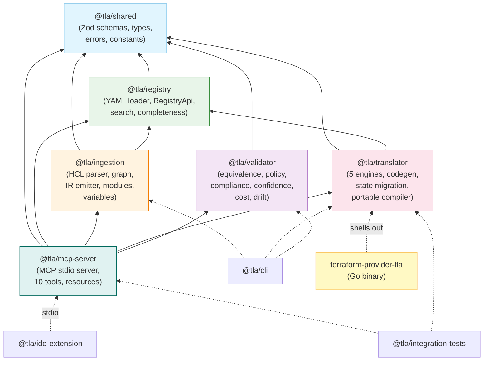

### Dependency Rules

- **`@tla/shared`** depends on nothing (leaf). Contains all Zod schemas, TypeScript types, error classes, constants, and the audit logger.
- **`@tla/registry`** depends only on `@tla/shared`. Loads YAML mapping files, provides `RegistryApi` with `lookup()`, `search()`, and `getCompleteness()`.
- **`@tla/ingestion`** depends on `shared` + `registry`. Parses HCL, builds dependency graphs, emits the Canonical IR.
- **`@tla/translator`** depends on `shared` + `registry`. Five mapping engines, two codegen backends (Azure/GCP), expression translation, state migration, portable compiler.
- **`@tla/validator`** depends only on `shared`. Equivalence checking, OPA policy engine, CIS compliance, confidence scoring, cost estimation, drift detection.
- **`@tla/mcp-server`** depends on all five core packages. Integrates everything behind an MCP stdio transport.

---

## 4. Canonical IR

The Canonical Intermediate Representation is the central data structure. All upstream parsing converges into it; all downstream translation reads from it. The IR is **immutable** once emitted -- engines never mutate it.

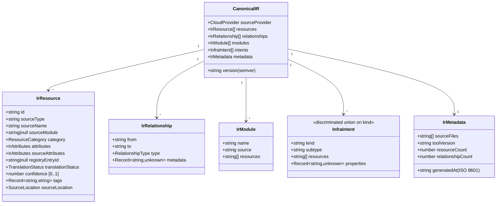

### IrResource Fields

| Field | Type | Description |
|-------|------|-------------|
| `id` | `string` | Unique identifier (e.g., `aws_instance.web`) |
| `sourceType` | `string` | AWS resource type (e.g., `aws_s3_bucket`) |
| `sourceName` | `string` | Terraform resource name label |
| `sourceModule` | `string \| null` | Module path if nested, null for root |
| `category` | `ResourceCategory` | Service family: compute, storage, database, networking, security, serverless, messaging, observability, containers, identity |
| `attributes` | `Record<string, unknown>` | Normalized attributes for translation |
| `sourceAttributes` | `Record<string, unknown>` | Raw HCL attributes preserved verbatim |
| `registryEntryId` | `string \| null` | Matched registry entry ID (SER-XXX-XXX-NNN) |
| `translationStatus` | `TranslationStatus` | pending, translated, expanded, partial, blocked, advisory |
| `confidence` | `number` | 0.0 to 1.0 base confidence score |
| `tags` | `Record<string, string>` | Resource tags (passthrough to target) |
| `sourceLocation` | `SourceLocation` | File path, line, column for diagnostics |

### Intent Types (Discriminated Union)

The IR captures 7 intent kinds that describe cross-cutting infrastructure concerns:

| Kind | Subtypes | Purpose |
|------|----------|---------|
| `networking` | vpc, subnet, security_group, load_balancer, nat, route_table, peering | Network topology preservation |
| `identity` | role, policy, user, group, service_account | IAM intent mapping |
| `encryption` | key_management, at_rest, in_transit | Encryption requirements |
| `scaling` | auto_scaling, application_scaling, scheduled | Elasticity intent |
| `resilience` | multi_az, backup, replication, failover | HA/DR requirements |
| `observability` | monitoring, logging, tracing, alerting | Monitoring intent |
| `secret` | secret_store, parameter_store, rotation | Secret management intent |

---

## 5. Engine Types

The translation compiler dispatches each resource to one of five mapping engines based on the `mapping_type` field in its registry entry.

### Dispatch Flow

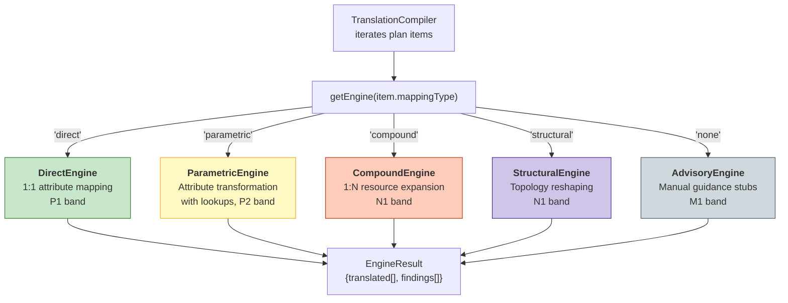

### Engine Comparison Table

| Engine | Type | Band | Ratio | Description | Example Resources |
|--------|------|------|-------|-------------|-------------------|
| **Direct** | `direct` | P1 | 1:1 | Straightforward attribute mapping. Region/SKU lookups via `REGION_MAP` and `NODE_TYPE_SKU_MAP`. | S3, ECR, ElastiCache Redis, Route53 zones |
| **Parametric** | `parametric` | P2 | 1:1 | Attribute transformation with cross-resource lookups. Reads sibling resources for VPC/subnet references. | VPC, Subnet, NAT Gateway, KMS, Secrets Manager, EKS, Direct Connect, VPN |
| **Compound** | `compound` | N1 | 1:N | One AWS resource expands to multiple target resources. Internal Terraform interpolation refs between outputs. | EC2 (VM+NIC+Disk), ASG (VMSS/MIG), ALB/NLB (AppGW+PIP / LB+PIP), RDS (FlexServer+DB), API Gateway (APIM+API) |
| **Structural** | `structural` | N1 | M:N | Topology reshaping preserving security/behavioral intent. Intent-driven supplementary analysis. BLOCKER gate on rule broadening. | Security Groups, Lambda (trigger detection), ECS (launch type), SQS/SNS (FIFO), CloudWatch, WAF, Step Functions |
| **Advisory** | `none` | M1 | 0:0 | No automated translation. Generates manual task findings with migration guidance. | DynamoDB (pattern detection), IAM, CloudFront, Route53 health checks, ElastiCache Cluster |

### Direct Engine Dispatch

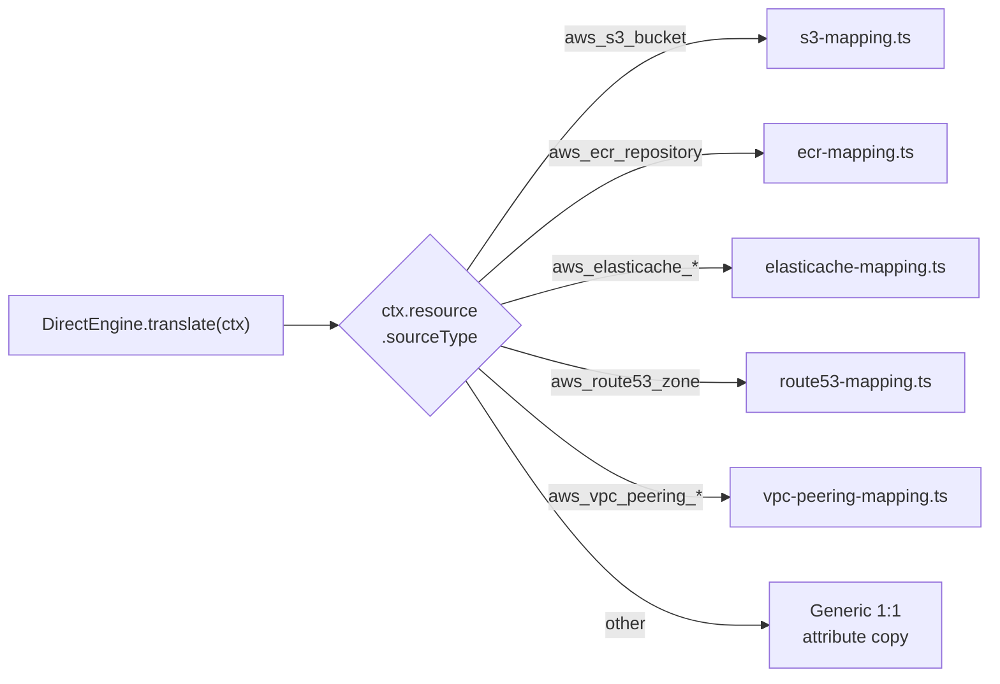

### Compound Expansion Example

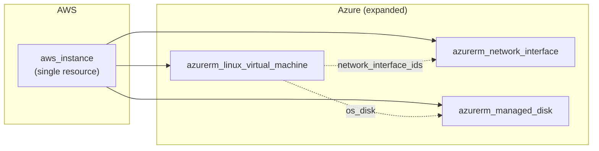

---

## 6. Registry Data Model

The registry is a set of YAML files, each containing one or more `RegistryEntry` records. The `RegistryApi` class provides lookup, search, and completeness reporting.

### RegistryEntry Fields

| Field | Type | Description |
|-------|------|-------------|
| `registry_entry_id` | `string` | Unique ID matching `SER-[FAMILY]-[CODE]-NNN` |
| `aws_service` | `string` | AWS resource type (e.g., `aws_s3_bucket`) |
| `aws_family` | `AwsServiceFamily` | compute, storage, database, networking, security, serverless, messaging, observability, containers, identity |
| `azure_targets` | `string[]` | Azure resource types this maps to |
| `gcp_targets` | `string[]` | GCP resource types this maps to |
| `mapping_type` | `MappingType` | direct, parametric, compound, structural, none |
| `output_mode` | `OutputMode` | portable, native_emit_only, advisory_manual |
| `band` | `TranslationBand` | P1 (highest confidence), P2, N1, M1 (manual-only) |
| `confidence` | `number` | 0.0 to 1.0 base translation confidence |
| `portable_provider_candidate` | `boolean` | Whether a `cloud_*` abstraction exists |
| `behavioral_gaps` | `BehavioralGap[]` | Known behavioral divergences |
| `manual_review_required` | `boolean` | Whether human review is mandatory |
| `review_domains` | `ReviewDomain[]` | Domains requiring review: networking, security, identity, data, compliance |
| `test_status` | `TestStatus` | untested, unit_tested, integration_validated, e2e_validated |
| `owner` | `string` | Team or individual responsible |
| `registry_version` | `string` | Date-based version (YYYY.MM.DD) |
| `last_updated` | `string` | ISO 8601 datetime |
| `related_requirements` | `string[]` | Requirement IDs (REQ-XXX-NNN) |
| `related_edge_cases` | `string[]` | Edge case IDs (EC-NNN) |

### BehavioralGap Fields

| Field | Type | Description |
|-------|------|-------------|
| `gap_id` | `string` | Unique ID matching `BGR-[FAMILY]-[CODE]-NNN` |
| `gap_type` | `GapType` | feature, topology, policy, runtime, data_model |
| `description` | `string` | Human-readable gap description |
| `severity` | `GapSeverity` | blocker, major, minor, informational |
| `affected_targets` | `CloudProvider[]` | Which targets are affected (azure, gcp, or both) |
| `workaround` | `string \| null` | Known workaround, if any |
| `requires_manual_review` | `boolean` | Whether this gap forces manual review |

### Band Classification

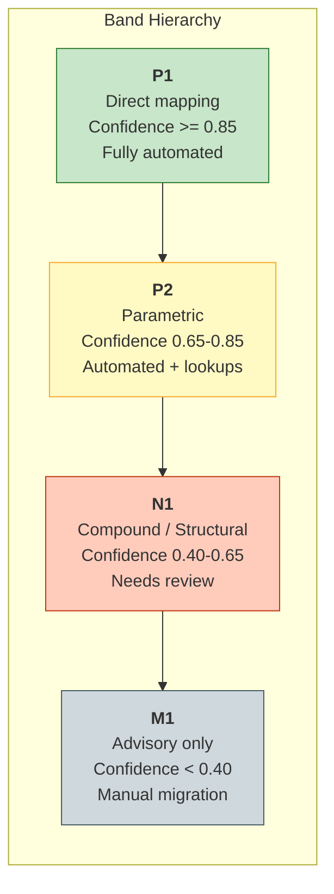

---

## 7. Validation Pipeline

The validator runs up to 7 checks in strict dependency order. Each check can be individually selected. Downstream checks are skipped if an upstream dependency is unavailable.

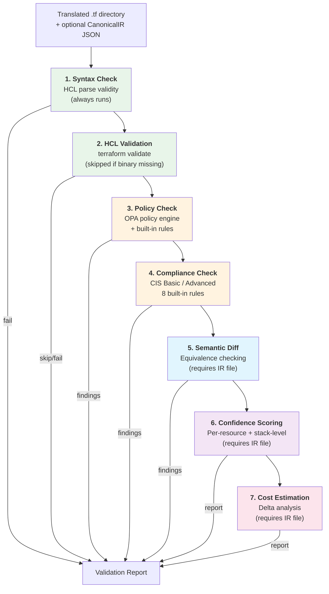

### Check Details

| # | Check | Input Required | Key Module | Output |
|---|-------|----------------|-----------|--------|
| 1 | **Syntax** | `.tf` files | HCL parser | Parse errors |
| 2 | **HCL Validation** | `terraform` binary | `terraform validate` | Validation diagnostics |
| 3 | **Policy** | Translated resources | `evaluatePolicies`, `evaluateOpa` | `PolicyReport` with pass/fail per rule |
| 4 | **Compliance** | Translated resources | `checkCompliance` with CIS profiles | `ComplianceReport` (encryption, network, IAM, logging) |
| 5 | **Semantic Diff** | IR file | `checkEquivalence` (presence, attributes, intents, references) | `EquivalenceReport` per resource |
| 6 | **Confidence** | IR file + upstream results | `scoreConfidence` | `ConfidenceReport` with per-resource, family, and stack scores |
| 7 | **Cost** | IR file | `estimateCostDelta` | `CostDeltaReport` with per-resource cost comparisons |

### Built-in Compliance Rules (CIS)

| Rule ID | Check | Severity |
|---------|-------|----------|
| `encryptionAtRest` | Storage/DB encryption enabled | blocker |
| `encryptionInTransit` | TLS/HTTPS enforcement | blocker |
| `networkOpenIngress` | No 0.0.0.0/0 ingress on all ports | blocker |
| `networkSshRestricted` | SSH not open to world | major |
| `networkPublicIp` | Public IP association flagged | warning |
| `loggingEnabled` | Audit/access logging active | major |
| `iamAdminPolicy` | No admin-level IAM policies | blocker |
| `iamMfaRequired` | MFA enforcement on IAM | major |

---

## 8. Confidence Scoring

Confidence is computed at three levels: per-resource, per-service-family, and stack-wide. The formula ensures that validation failures, semantic drift, and policy violations all degrade the score.

### Per-Resource Formula

```
resource_score = registry_confidence
               * validation_factor
               * semantic_factor
               * policy_factor
```

| Factor | Source | Values |
|--------|--------|--------|
| `registry_confidence` | `RegistryEntry.confidence` | 0.0 -- 1.0 (0.5 if unknown) |
| `validation_factor` | HCL validation status | clean=1.0, warnings=0.5, errors=0.0 |
| `semantic_factor` | Equivalence classification | preserved=1.0, transformed=0.8, partial=0.5, missing=0.2 |
| `policy_factor` | Policy evaluation | `max(0, 1 - 0.2*warnings - 0.5*failures)` |

### Semantic Status Mapping

| Equivalence Classification | Semantic Status | Factor |
|---------------------------|-----------------|--------|
| equivalent | preserved | 1.0 |
| partial | transformed | 0.8 |
| degraded | partial | 0.5 |
| missing | missing | 0.2 |

### Stack-Level Aggregation

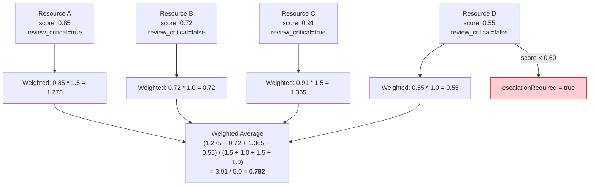

**Review-critical domains** (security, identity, networking) receive **1.5x weighting** in stack aggregation because errors in these domains have outsized operational risk.

**Escalation rule**: If any single resource scores below 0.60, the entire stack report sets `escalationRequired = true`.

### Confidence Bands

| Band | Score Range | Meaning |
|------|------------|---------|
| **high** | >= 0.80 | Safe for automated deployment |
| **medium** | 0.60 -- 0.79 | Review recommended |
| **low** | 0.40 -- 0.59 | Significant manual review required |
| **critical** | < 0.40 | Manual migration or redesign needed |

---

## 9. MCP Server Architecture

The MCP server exposes the full TLA pipeline over the Model Context Protocol stdio transport, making it directly usable from Claude Code, VS Code, and other MCP-compatible clients.

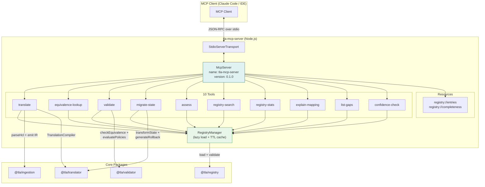

### Tool Summary

| Tool | Input | Pipeline Stages Used | Output |
|------|-------|---------------------|--------|
| `translate` | source path/content, target, scope | Parse -> Graph -> IR -> Plan -> Emit -> Codegen | TranslationResult (files + manifest) |
| `equivalence-lookup` | service type(s), target, detail level | Registry lookup only | Mapping summary or full entry |
| `validate` | translated dir, provider, optional IR | Syntax -> HCL -> Policy -> Compliance -> Semantic -> Confidence -> Cost | Validation report |
| `migrate-state` | state file, translation dir, target | State transformer | Move/import/remove commands + rollback |
| `assess` | source path, target | Parse -> Inventory (stub) | Assessment report |
| `registry-search` | family, band, mapping_type, min_confidence | Registry search | Filtered entries |
| `registry-stats` | (none) | Registry completeness | Aggregate statistics |
| `explain-mapping` | AWS type, target | Registry lookup | Detailed mapping explanation |
| `list-gaps` | optional type, severity, target | Registry gap scan | Behavioral gap list |
| `confidence-check` | AWS type, target | Registry lookup + gap analysis | Confidence factors |

### RegistryManager Caching

The `RegistryManager` implements lazy-load with TTL-based cache invalidation:

1. First tool call triggers `loadRegistryFromDirectory()` + `validateRegistryEntries()`
2. Subsequent calls within the TTL window return the cached `RegistryApi`
3. After TTL expiry, next call re-loads from disk
4. If `registryDir` is not configured, all tools return a structured error

---

## 10. State Migration

The state transformer converts AWS Terraform state into target-provider state commands, enabling `terraform state mv`/`import`/`rm` workflows.

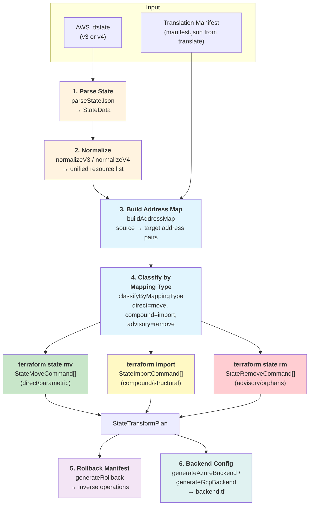

### Command Generation Rules

| Mapping Type | Command | Notes |
|--------------|---------|-------|
| direct / parametric | `terraform state mv` | Address rename only |
| compound | `terraform import` | New resources need import; may be `manualTask=true` |
| structural | `terraform import` | Topology reshape requires fresh import |
| advisory / none | `terraform state rm` | Source resource removed from state |

### Rollback Manifest

The rollback generator produces inverse operations for every forward command:

- `mv A B` generates `mv B A` (inverse move)
- `import addr id` generates `state rm addr` (inverse import)
- `rm addr` records the original address for manual re-import

### Backend Migration

Two backend generators produce target-provider HCL:

- **Azure**: `azurerm` backend with `resource_group_name`, `storage_account_name`, `container_name`, `key`
- **GCP**: `gcs` backend with `bucket`, `prefix`

The `migrateBackend` function orchestrates S3 detection + backend generation + state migration commands.

---

## 11. Portable Provider

The portable provider introduces `cloud_*` resources -- provider-agnostic Terraform resource types that compile down to native provider HCL at plan/apply time.

### Architecture

```mermaid
flowchart TB
    subgraph "User Configuration"
        HCL["resource \"cloud_object_storage\" \"data\" {<br/>  name = \"my-bucket\"<br/>  versioning = true<br/>  encryption { algorithm = \"AES256\" }<br/>}"]
    end

    subgraph "TypeScript Compiler"
        PC["portable-compiler.ts<br/>compilePortableResource()"]
        PC --> AWS_E["AWS emitter:<br/>aws_s3_bucket +<br/>aws_s3_bucket_versioning"]
        PC --> AZ_E["Azure emitter:<br/>azurerm_storage_account +<br/>azurerm_storage_container"]
        PC --> GCP_E["GCP emitter:<br/>google_storage_bucket"]
    end

    subgraph "Go Terraform Provider"
        Prov["terraform-provider-tla<br/>(Go binary)"]
        Prov --> COS["cloud_object_storage<br/>resource"]
        Prov --> CCR["cloud_container_registry<br/>resource"]
        Prov --> CCRedis["cloud_cache_redis<br/>resource"]
        Prov --> HW["hcl_writer.go<br/>+ mappings.go"]
    end

    subgraph "Exit Path"
        EP["exit-path.ts<br/>emitNativeEquivalent()"]
        EP -->|"produces"| NativeHCL["Native .tf files<br/>(no cloud_* dependency)"]
    end

    HCL --> Prov
    HCL --> PC
    PC --> NativeHCL2["Native .tf output"]
    Prov -->|"plan/apply"| Created["Cloud Resources"]

    style PC fill:#fce4ec,stroke:#c62828
    style Prov fill:#fff9c4,stroke:#f9a825
    style EP fill:#e8f5e9,stroke:#388e3c
```

### Supported Portable Resource Types

| Portable Type | AWS Target | Azure Target | GCP Target |
|--------------|------------|--------------|------------|
| `cloud_object_storage` | `aws_s3_bucket` + versioning + encryption | `azurerm_storage_account` + `azurerm_storage_container` | `google_storage_bucket` |
| `cloud_container_registry` | `aws_ecr_repository` | `azurerm_container_registry` | `google_artifact_registry_repository` |
| `cloud_cache_redis` | `aws_elasticache_replication_group` | `azurerm_redis_cache` | `google_redis_instance` |

### Go Provider Schema

The Go provider (`terraform-provider-tla`) implements the Terraform Plugin Framework:

```
provider "tla" {
  target_provider = "azure"   # or "gcp"
  output_dir      = "./out"
}
```

Resources are defined in `internal/resources/` with provider-specific attribute mapping in `mappings.go`. The `hcl_writer.go` module emits syntactically correct HCL blocks (with the block-vs-attribute distinction required by providers like `azurerm`).

### Exit Path

The exit path (`emitNativeEquivalent()`) is the escape hatch: it takes `cloud_*` resources and produces pure native-provider HCL with zero dependency on the TLA provider binary. This allows teams to adopt the portable abstraction for migration and then "eject" to standard Terraform when ready.

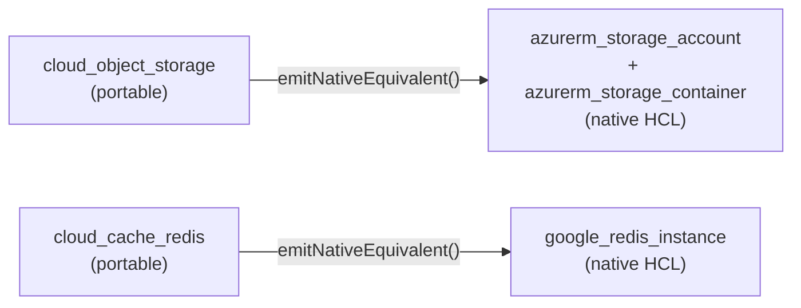

---

## Appendix A: Technology Stack

| Layer | Technology | Version |
|-------|-----------|---------|
| Runtime | Node.js | >= 22.0.0 |
| Language (TS) | TypeScript | ~5.8.3 |
| Language (Go) | Go | 1.21+ |
| Schema Validation | Zod | ^3.24.4 |
| HCL Parsing | @cdktf/hcl2json | ^0.21.0 |
| Registry Format | YAML | via `yaml` ^2.8.2 |
| Logging | Pino | ^9.6.0 |
| MCP SDK | @modelcontextprotocol/sdk | ^1.27.1 |
| TF Provider Framework | terraform-plugin-framework | (Go module) |
| Build (TS) | tsup / tsc | ^8.5.1 |
| Test | Vitest | ^3.1.1 |
| Monorepo | pnpm workspaces | -- |

## Appendix B: File Output Structure

A full translation produces the following file tree in the output directory:

```
output/
  main.tf              # Translated resources
  providers.tf         # Provider block (azurerm/google)
  terraform.tf         # Required providers + version constraints
  variables.tf         # Input variables (subscription_id, region, etc.)
  outputs.tf           # Output values
  manifest.json        # Translation manifest with per-resource status
  ir.json              # Source CanonicalIR (when --save-ir is set)
  remediation.json     # Remediation pack (when gaps exist)
  backend.tf           # Target backend config (when --migrate-state)
  rollback.json        # Rollback manifest (when --migrate-state --rollback)
```
